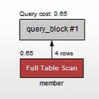

# 인덱스

## 인덱스 사용하기

- 각 행 데이터에 인덱스를 부여해서 인덱스를 이용한 탐색을 가능하게 할 수 있습니다.

- 회원 테이블에서 회원 이름에 인덱스를 부여하려고 한다면 다음과 같은 쿼리문으로 인덱스를 부여할 수 있습니다.

  ```SQL
  CREATE INDEX idx_member_name ON member(member_name);
  ```

- 인덱스를 사용하는 데이터 조회가 인덱스를 부여하지 않은 조회보다 빠릅니다. 다음과 같은 내용을 Workbench의 Execution plan에서 확인할 수 있습니다.

  
  
